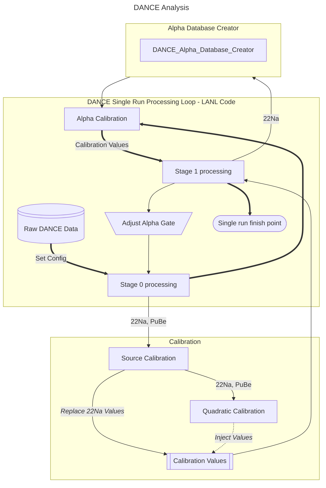
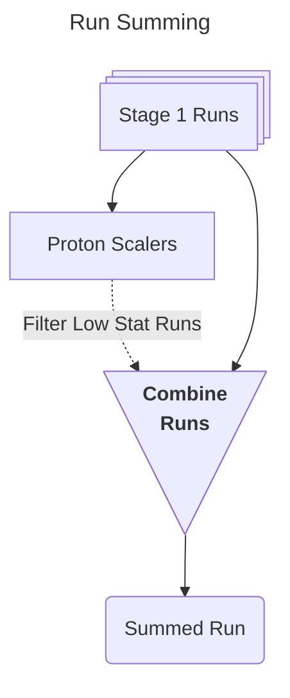
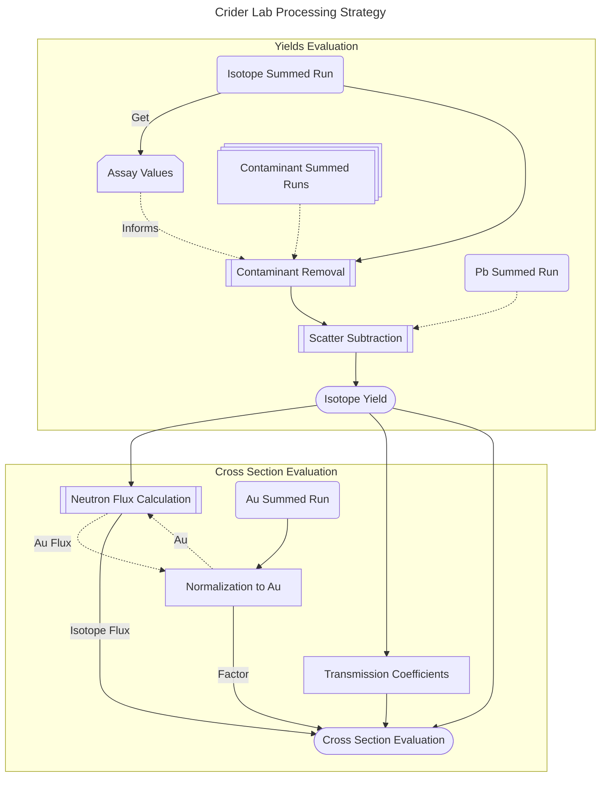
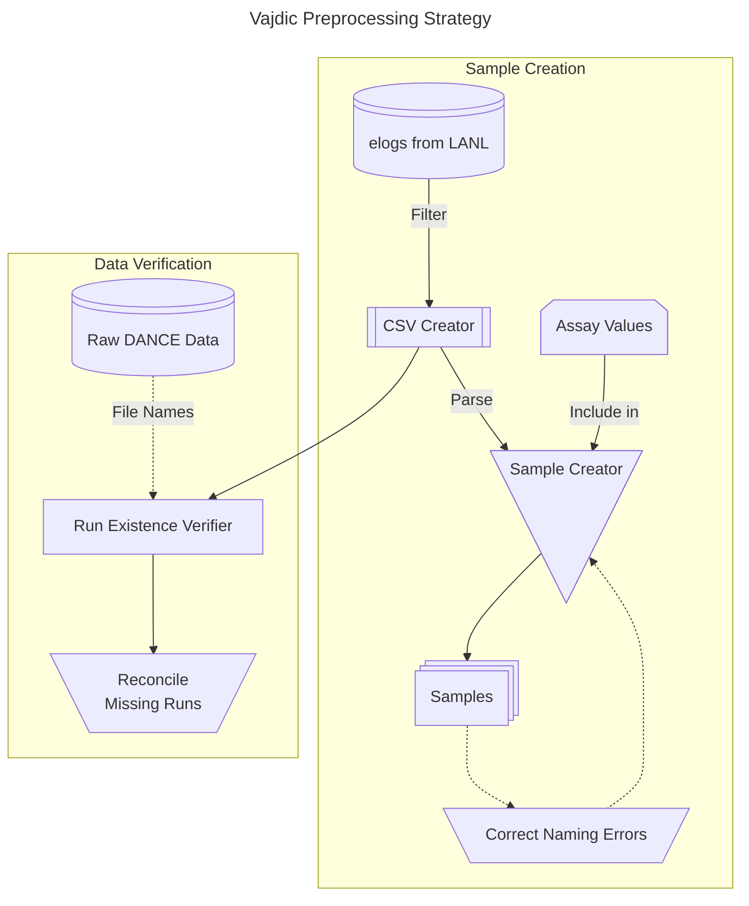

# Crider Lab DANCE Analysis Suite

## Analysis Overview

The following flow charts show the whole process of data analysis. I will describe features that I included in each portion


### Alpha Database Creator
Alpha_Database_Creator had hardcoded naming conventions that would break between different years. The names were adjusted to fit the local dataset and the program was modified to be easier to use later by moving variable instantiation to the top of the file. For example instead of: 
```cpp
get("name_from_2013");
```
which was present in the original file, I simply modified the behavior to:

```cpp
//histogram_name = "name_from_2013";
histogram_name = "name_from_2018";

//code

get(histogram_name);

//code
```

### DANCE Single Run Processing Loop - LANL Code
The main loop for processing a single run is only lightly modified to the extent that is it workable on the local machine. This involves commenting out lines and adding local directories to configuration files and bash scripts.

### Calibration
Calibration is done based on source information. Performing Quadratic Calibration requires two different sources run in the source calibration code. I modified both the source calibration and the quadratic calibration so they can be run by scripts. I adjusted the code of the source calibration so it's easier to read and use. I similarly cleaned up the quadratic calibration code as well. I added new code functionality where after generating the calibration values, the program automatically inserts those values into a relevant list of text files provided

Example changes:

```cpp
//source_calibration
source_calibration(){

    source = "Na";
    //source = "PuBe";

    Compton_values = [{111,222}, //Na
                       {112,223} //PuBe
    ];

    Low_values = [{1,2}, //Na
                   {.1,.2} //PuBe 
    ];

    //code
}

```

```cpp
//quadratic_calibration
quadratic_calibration(){

    file_1 = "Na_calibrated";
    file_2 = "PuBe_calibrated";

    //code  

}
```

were changed to:
```cpp
//source_calibration
source_calibration(std::string source_name){

    Na_values = [
        {111,222},
        {1,2}
        ];

    PuBe_values = [
        {112,223}
        {0.1,0.2}
        ];

    source_map["Na"] = Na_values;
    source_map["PuBe"] = PuBe_values;

    input_values = source_map<source_name>;

}
```

```cpp
//quadratic_calibration
quadratic_calibration(low_energy_fname,high_energy_fname){

    //code

}

```

An additional file was added which injects the quadratic values into other runs:

```cpp
modify_runs(quadratic_values, runs_to_modify){
    
    for(int run : runs_to_modify){
        vector<double[]> calibration_values;
        read_in_calibration_file(run,calibration_values);
        
        inject_quad_values(calibration_values, quadratic_values);
    }

    return;

}
```

Then I made a script to make sure my newly written files are used in the research process:

```bash
NaFile="Na_fname"
PuBeFile="PuBe_fname"

runs_to_modify="1,2,3,4,8"

Qaudratic_Calibration(NaFile,PuBeFile,runs_to_modify)

rsync quad_output_folder calibration_folder

```

##


This flowchart is self explanatory. I did rewrite the run summing program so that it combines all histograms with the same name and not just the one particular histogram of interest

## Criderlab Processing Strategy



I spent the most time refactoring the Crider Lab Processing Strategy. For example, run summing and contaminant removal both use proton scalers. The code I inherited had two different versions of this implemented in separate files. I extracted that out into one uniform file that is used both by the run summing code and the contaminant removal code. I also updated it to be configurable names instead of hard-coded names so that it's less likely to break between years of data.

The logic of how the code processes the summed run data is the same however the way it handles retrieving information and moving it around is very different. Every part of the process also writes an output log so the user can see if and where the program crashes. In its current state these parts are all compiled completely separately but are now run using a parameters file I created to hold all the adjustable user paramters. The code I inherited was designed to perform the analysis on one isotope and everything else had to be manually filled in. It is now configurable without having to recompile.

I also added a lot of commentary. Every file in the program now has a section at the top that lists when it was last edited, which part of the process it is relevant to, a description of inputs and outputs, and a description of how the code works and any flaws that will need to be addressed in the future.

As part of quality of life updates, there are also toggles for graphics. For example, plots now have a toggleable feature where you can indicate in bright red in the corner of the plot that it is a preliminary plot and not a final published plot. When calculating how much contaminant to subtract off, the program also pulls in the assay information from a sample file (see below) instead of an unclearly labeled text file of numbers. 

The parameters file is also probably the most useful addition. Since the process is broken up into stages, the paramater metadata used is also stored in the files between the stages as a ROOT TTree. This way if a user changes a paramater for a yield that is used again in the final cross section evaluation, it will carry over from the yield file used instead of using the newly changed parameter.

##

## Vajdic Preprocessing Strategy



This last section is entirely new code written by me. 

First I wrote boiler plate code to help me [utils folder], such as a program that retrieves filenames in a given directory and stores them in a vector. This was necessary as I was using C++14 which does not include that functionality in the standard library. Other examples include a program that plots, all of the helper functions to retrieve the data I am creating for use in code, and a file that loads a two column text file into a map. 

In the system, the run data and what isotope was in the machine are not kept in the same place. There were log files the user could consult but it was mostly up to the end user to manually create a spreadsheet of which runs were associated with which isotopes. 

I created a bash script to parse log files to do that for me. The user can specify which isotopes to regex match in the script and then they are collected into a csv file. CSV creator then takes the individual runs and groups them according to the meta data. The bash script will simply have a list that says run 1 is Na22, performed on this date, etc. CSV creator will condense consequtive runs so that if runs 1 through 8 are all Na22, then they will be grouped together as one entry for Na22 that specifies it is runs 1 through 8.

I also collected assay composition information to create a sample, which is what I updated Crider Lab Processing Strategy to use. Using the information from the csv created by CSV Creator, sample creator groups all runs with a unique name. For example if I have Co60_1943 as my unique sample and it was used for runs 15 through 30 in the year 2015 and then used for runs 60 through 90 in the year 2016, that information is now all in the same place and can be referenced. The assay information for Co60_1943 would be stored in an assay directory and called Co60_1943.assay. Sample creator searches the assay directory and matches Co60_1943. It then copies that over into the sample file as well before writing the file. This way all pertinent isotope information is stored in an easily readable text file.

One last problem I solved is the issue of existence. I know which isotope I am running. I want to know how much progress I have made. Is my sum file made up of all the files we have avaialable? I solved this issue for all isotopes. First, the program consults the csv from CSV Creator. CSV Creator should be a list of all the runs that are needed in the raw data directory. Run Existence Verifier looks at all of the runs in the raw data directory and then outputs a list of runs that are present in the CSV file but not in the raw data directory. As an added bonus it also checks the status of runs, inidicating if those runs have also been processed and exist in the Stage 0 and Stage 1 output directories. Lastly, Run Existence Verifier travels the other direction. It outputs which files are in the raw data directory but are not associated with any isotopes listed in the CSV file. This way if a new isotope needs to be added to the log file parser it can be noticed

The Vajdic Preprocessing Strategy worked to mitigate human errors from copying values by hand and even allowed for easy corrections of errors in the log files themselves.